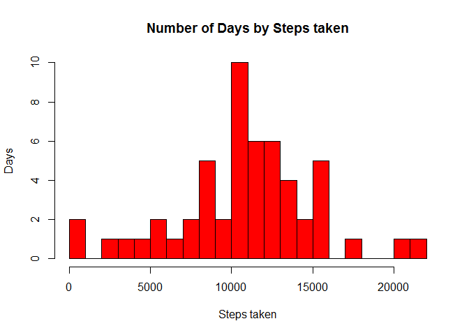
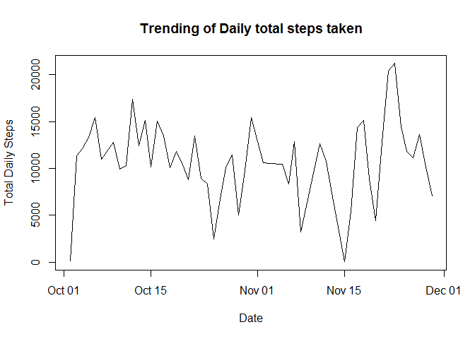
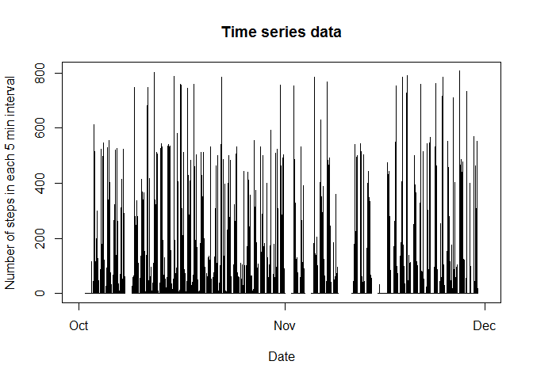
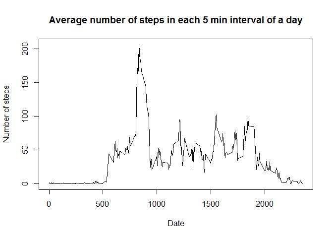
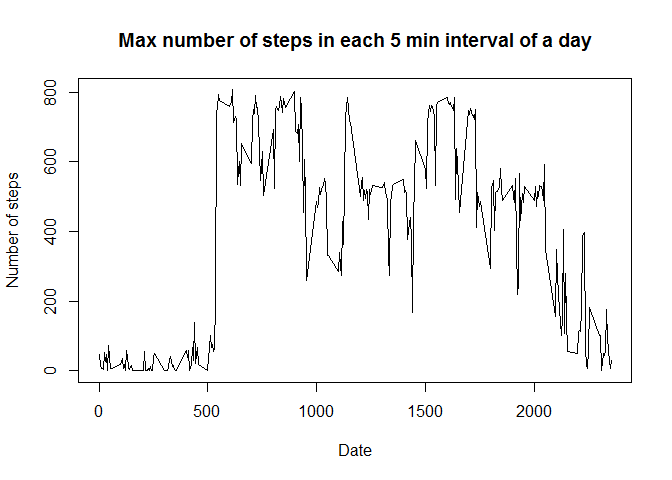
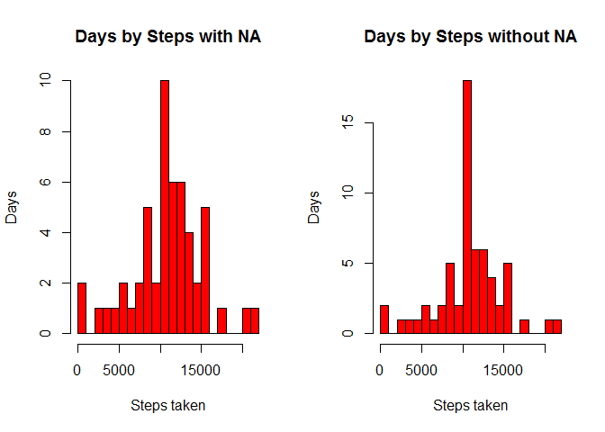
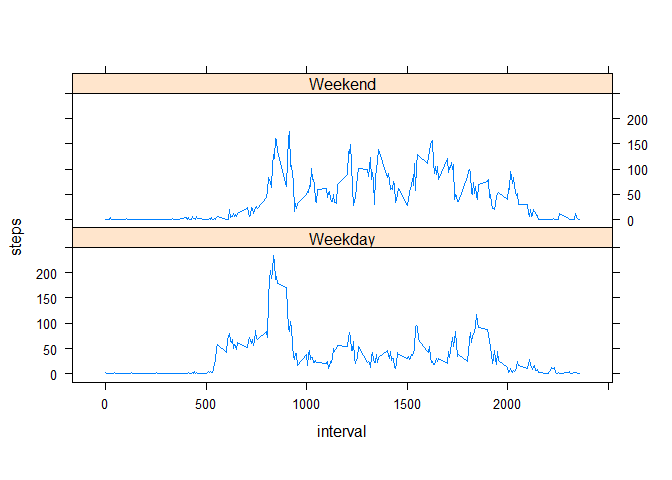

# Reproducable Research - Assignment 1
Bijay Ghimire  
February 7, 2016  

#Introduction
Analyze activity monitoring data to address key question related to the activity pattern and trend. This analysis makes use of data from a personal activity monitoring device. This device collects data at 5 minute intervals through out the day. The data consists of two months of data from an anonymous individual collected during the months of October and November, 2012 and include the number of steps taken in 5 minute intervals each day.

Data is downloaded from [Activity monitoring data](https://d396qusza40orc.cloudfront.net/repdata%2Fdata%2Factivity.zip).


##Load, analyze and cleanse the data

```r
setwd("C:\\Personal\\DataScientistCourse\\06_Reproducable Research\\Assignment1")
fitnessActivityData <- read.table("activity.csv", 
                                   header=TRUE, 
                                   sep=",", 
                                   colClasses=c(
                                    "integer", 
                                     "character",
                                     "integer"
                                   )
)
```

Analyze table and field values

```r
str(fitnessActivityData)
```

```
## 'data.frame':	17568 obs. of  3 variables:
##  $ steps   : int  NA NA NA NA NA NA NA NA NA NA ...
##  $ date    : chr  "2012-10-01" "2012-10-01" "2012-10-01" "2012-10-01" ...
##  $ interval: int  0 5 10 15 20 25 30 35 40 45 ...
```

Check table summary

```r
summary(fitnessActivityData)
```

```
##      steps            date              interval     
##  Min.   :  0.00   Length:17568       Min.   :   0.0  
##  1st Qu.:  0.00   Class :character   1st Qu.: 588.8  
##  Median :  0.00   Mode  :character   Median :1177.5  
##  Mean   : 37.38                      Mean   :1177.5  
##  3rd Qu.: 12.00                      3rd Qu.:1766.2  
##  Max.   :806.00                      Max.   :2355.0  
##  NA's   :2304
```

Create new field to represent timestamp with date and time of the day

```r
#interval field representd hour and minute so convert this to time stamp so that we can apply timeseries

#Convert interval to time stamp to represent HHMM
#Convert to date stamp yyyy-mm-dd HH:MM format from interval and date field

#Pre-pend '000' as the interval field 
fitnessActivityData[["TimeStamp"]]<-paste("000",fitnessActivityData[["interval"]],sep="")

#HHMM forrmat of the time stamp
fitnessActivityData[["TimeStamp"]]<-substr(fitnessActivityData[["TimeStamp"]],
                                           nchar(fitnessActivityData[["TimeStamp"]])-3,
                                           nchar(fitnessActivityData[["TimeStamp"]])
                                           )
#concat date part to construct time stamp in yyyy-mm-dd HH:MM format
fitnessActivityData[["TimeStamp"]]<-paste(fitnessActivityData[["date"]],fitnessActivityData[["TimeStamp"]])

#convert timestamp field from char to time (POSIXct)
fitnessActivityData[["TimeStamp"]]<-as.POSIXct(fitnessActivityData[["TimeStamp"]],
                                            format="%Y-%m-%d %H%M",tz = "GMT")
```


Change the data type of date to date

```r
fitnessActivityData[["date"]] <- as.Date(fitnessActivityData[["date"]])
```

#Histogram of the total number of steps taken each day


```r
dailyTotalSteps <- aggregate(steps ~ date, data=fitnessActivityData, FUN=sum, na.rm = TRUE)

hist(dailyTotalSteps$steps,breaks=20, main = "Number of Days by Steps taken", xlab = "Steps taken", ylab = "Days", col = "red")
```

 


#Mean and median number of steps taken each day

```r
mean(dailyTotalSteps$steps,na.rm=TRUE)
```

```
## [1] 10766.19
```

```r
median(dailyTotalSteps$steps,na.rm=TRUE)
```

```
## [1] 10765
```

#Time series plot of the average number of steps taken

Daily time series plot


```r
dailyTotalSteps <- aggregate(steps ~ date, data=fitnessActivityData, FUN=sum, na.rm = TRUE)

plot(x=dailyTotalSteps$date, 
     y=dailyTotalSteps$steps, type="l", 
     main="Trending of Daily total steps taken",
     xlab="Date", 
     ylab="Total Daily Steps"
     )
```

 


Timeseries data as available in raw data

```r
plot(x=fitnessActivityData$TimeStamp, 
     y=fitnessActivityData$steps, type="l", 
     main="Time series data",
     xlab="Date", 
     ylab="Number of steps in each 5 min interval"
)
```

 


#The 5-minute interval that, on average, contains the maximum number of steps
Daily time series plot with average steps in each 5 min interval

```r
intervalAverage <- aggregate(steps ~ interval, data=fitnessActivityData, FUN=mean, na.rm = TRUE)
plot(x=intervalAverage$interval, 
     y=intervalAverage$steps, type="l", 
     main="Average number of steps in each 5 min interval of a day",
     xlab="Date", 
     ylab="Number of steps"
)
```

 


Daily time series plot with maximun steps in each 5 min interval


```r
intervalMax <- aggregate(steps ~ interval, data=fitnessActivityData, FUN=max, na.rm = TRUE)
plot(x=intervalMax$interval, 
     y=intervalMax$steps, type="l", 
     main="Max number of steps in each 5 min interval of a day",
     xlab="Date", 
     ylab="Number of steps"
)
```

 

#Imputing missing values
I am using average value to fill in the missing value for each 5 minute interval.There are other stratigies as well - taking median of each interval. To simplyfy the computation one can also take mean or median of whole data to fill in the missing value, which will not be that accurate assumption. 


```r
intervalAverage <- aggregate(steps ~ interval, data=fitnessActivityData, FUN=mean, na.rm = TRUE)

fitnessActivityDataWithoutNA<-fitnessActivityData

fitnessActivityDataWithoutNA$steps[is.na(fitnessActivityDataWithoutNA$steps)]<-
  intervalAverage[match(
                        fitnessActivityDataWithoutNA$interval[is.na(fitnessActivityDataWithoutNA$steps)], 
                        intervalAverage$interval),2]
```

Let us check the summary of data to see the status of missing values:
Original data

```r
summary(fitnessActivityData$steps)
```

```
##    Min. 1st Qu.  Median    Mean 3rd Qu.    Max.    NA's 
##    0.00    0.00    0.00   37.38   12.00  806.00    2304
```

Here we see 2304  NA values

Data without NA 

```r
summary(fitnessActivityDataWithoutNA$steps)
```

```
##    Min. 1st Qu.  Median    Mean 3rd Qu.    Max. 
##    0.00    0.00    0.00   37.38   27.00  806.00
```

Here we do not see any NA values. Let us plot this and compare with original plot


```r
dailyTotalSteps <- aggregate(steps ~ date, data=fitnessActivityData, FUN=sum, na.rm = TRUE)
dailyTotalStepsWithoutNA <- aggregate(steps ~ date, data=fitnessActivityDataWithoutNA, FUN=sum, na.rm = TRUE)

par(mfrow=c(1,2))
hist(dailyTotalSteps$steps,breaks=20, main = "Days by Steps with NA", xlab = "Steps taken", ylab = "Days", col = "red")
hist(dailyTotalStepsWithoutNA$steps,breaks=20, main = "Days by Steps without NA", xlab = "Steps taken", ylab = "Days", col = "red")
```

 


#Weekend vs weekdays analysis - compare the activity

```r
fitnessActivityData$day <- weekdays(fitnessActivityData$date)
#Assign Weekend if day is Saturday or Sunday, othewise Weekday
fitnessActivityData$weekDayIndicator <- as.factor(ifelse(
    fitnessActivityData$day == "Saturday" | 
      fitnessActivityData$day == "Sunday", 
    "Weekend", "Weekday"))

intervalSummary <- aggregate(steps ~ interval + weekDayIndicator, data=fitnessActivityData, FUN=mean,na.rm=TRUE)

library(lattice)
xyplot(steps ~ interval | factor(weekDayIndicator), data=intervalSummary, aspect=1/4, type="l")
```

 

I see much activity throughout the day in weekends


***
